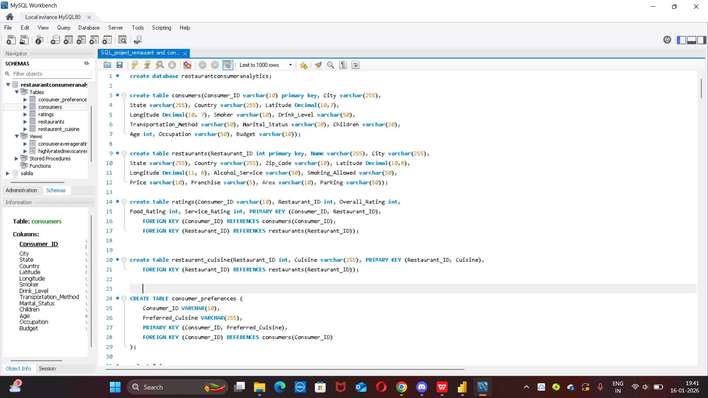

#  Restaurant Consumer Analytics (SQL Project)

##  Project Overview

The **Restaurant Consumer Analytics** project analyzes consumer demographics, dining preferences, restaurant attributes, and rating behavior using **SQL**.
The goal is to derive **actionable insights** about customer segments, restaurant performance, cuisine preferences, and rating patterns through advanced SQL queries, views, CTEs, and stored procedures.

This project demonstrates **strong SQL fundamentals**, **analytical thinking**, and **real-world data modeling**.

---

##  Technologies Used

* **Database:** MySQL
* **Language:** SQL
* **Visual tool** MYSQL WORKBENCH
* **Concepts:**

  * Relational Database Design
  * Joins & Subqueries
  * Aggregate Functions
  * Window Functions
  * CTEs (WITH clauses)
  * Views
  * Stored Procedures

---

##  Database Schema

### Database Name

```
restaurantconsumeranalytics
```

### Tables

1. **consumers** – Consumer demographics, lifestyle, and budget details
2. **restaurants** – Restaurant location, pricing, alcohol service, parking, and franchise info
3. **ratings** – Consumer ratings (Overall, Food, Service)
4. **restaurent_cuisine** – Restaurant cuisine mapping
5. **consumer_preferences** – Preferred cuisines per consumer

Each table is connected using **primary keys and foreign key constraints** to maintain data integrity.

---

##  Key Analysis Performed

###  Consumer Analysis

* Identified consumers by **city, occupation, age group, marital status**
* Segmented consumers by **budget** (Budget Conscious, Moderate Spender, Premium Spender)
* Analyzed **student behavior**, smokers, drink levels, and transportation usage

### 🍴 Restaurant Analysis

* Filtered restaurants by **cuisine, price range, alcohol service, franchise status**
* Evaluated restaurant performance using **average ratings**
* Identified **highly rated Mexican restaurants**

###  Rating Analysis

* Found restaurants with **above/below average ratings**
* Compared **consumer ratings vs overall restaurant averages**
* Ranked restaurant ratings using **window functions**
* Identified **top consumers** based on rating behavior

---

##  Advanced SQL Features Used

### ✔ Joins & Subqueries

* Multi-table joins across consumers, restaurants, cuisines, and ratings
* Subqueries for conditional filtering and exclusions

### ✔ CTEs (Common Table Expressions)

* City-specific consumer analysis
* Ranked cuisine preferences
* Filtered consumer segments

### ✔ Window Functions

* `RANK()`, `ROW_NUMBER()`, `LEAD()`
* Consumer-wise and restaurant-wise rating analysis

### ✔ Views

* `HighlyRatedMexicanRestaurants`
* `ConsumerAverageRatings`

### ✔ Stored Procedures

1. **GetRestaurantRatingsAboveThreshold**

   * Returns ratings above a given threshold for a restaurant

2. **GetConsumerSegmentAndRestaurantPerformance**

   * Determines consumer spending segment
   * Shows consumer rating summary
   * Compares individual ratings vs restaurant averages
   * Ranks restaurants for the consumer

---

## 📈 Sample Business Insights

* Identified **students with high engagement** and frequent restaurant visits
* Found **restaurants underperforming** compared to overall averages
* Highlighted **Mexican cuisine popularity** among high-rating consumers
* Segmented consumers based on **budget and rating behavior**

---

##  How to Run the Project

1. Create the database:

   ```sql
   CREATE DATABASE restaurantconsumeranalytics;
   ```
2. Execute table creation scripts
3. Insert dataset values (if available)
4. Run analysis queries, views, and stored procedures
5. Call procedures using:

   ```sql
   CALL GetConsumerSegmentAndRestaurantPerformance('U1001');
   ```

---

##  Learning Outcomes

* Designed a **normalized relational database**
* Wrote **complex analytical SQL queries**
* Used **real-world business logic** in stored procedures
* Strengthened understanding of **customer analytics & restaurant performance**

---

